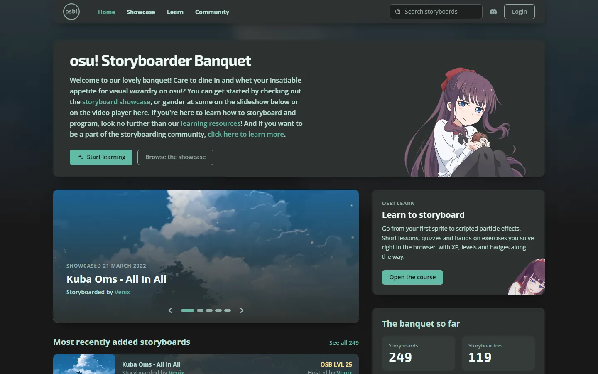
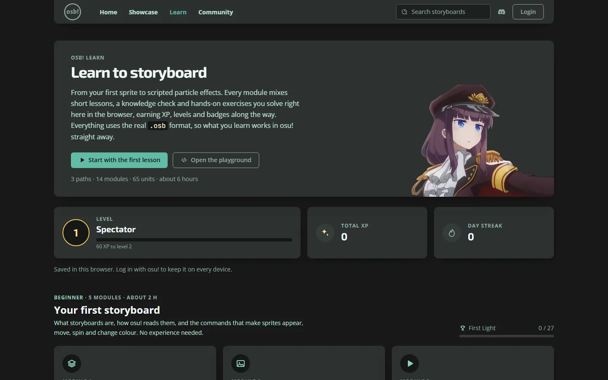

# osu! Storyboarder Banquet

[](https://discord.gg/B8NX7YW)

## Summary

This is [osu! Storyboarder Banquet](https://storyboarder.xyz/) website source code:

- **The storyboard showcase:** 249 handpicked storyboards, searchable by song, mapper and storyboarder and
  filterable by tag and tool, including the complete archive of the original showcase at
  [osb.moe](https://osb.moe/showcase). Anyone with an osu! account can submit a storyboard, and the
  osb team reviews each one.
- **The community pages**, with every storyboarder's profile and credits.
- **osb! learn:** an interactive storyboarding course from a first sprite to scripted particle effects,
  with an in-browser storyboard player, exercises, XP, levels and badges.



## Installation

1. Clone this repo
2. Install the [.NET 10 SDK](https://dotnet.microsoft.com/en-us/download/dotnet/10.0) and
   [Node.js 20 or newer](https://nodejs.org/) (for the CSS and JavaScript build)
3. Open the `osb` folder with terminal or command prompt
4. Run `dotnet run`, then browse to https://localhost:5001 (or http://localhost:5000)

The build runs `npm ci` and `npm run build` for you when the frontend sources change. On first start,
the app creates its SQLite database in `App_Data/osb.db` and fills in the showcase data. If the browser
warns about the HTTPS certificate, run `dotnet dev-certs https --trust` once.

Secrets such as the osu! OAuth client secret are not stored in this repo. To log in with osu! locally, set them as [user secrets](https://learn.microsoft.com/aspnet/core/security/app-secrets):

```
dotnet user-secrets set "API:ClientSecret" "<your osu! OAuth client secret>"
```

## Development

| Task | Command |
| --- | --- |
| Rebuild CSS and JavaScript on every change | `npm run watch` and `npm run watch:css`, next to `dotnet run` |
| Run the C# tests (course, showcase data and queries, submissions and reviews, osu! login, progress API, every page) | `dotnet test --project Tests` |
| Run the JavaScript tests (storyboard engine, learn progress, page scripts) | `npm test` |
| Test the deploy script (its install and rollback runs need Linux) | `bash deploy/tests/pi-install.test.sh` |
| Measure line coverage, like CI | `dotnet test --project Tests -p:Coverage=true`, and `npm run test:coverage` (Node.js 22 or newer) |
| Check the learn content against a running site | `dotnet run --urls http://localhost:5000`, then `npm run verify:content` |
| Add a database migration after changing `Data/` | `dotnet tool restore`, then `dotnet ef migrations add <Name> -o Data/Migrations` |
| Build without Node.js, reusing existing output | `dotnet build -p:SkipFrontend=true` |

Where things are:

- `Content/Learn/`: the learn course, written in Markdown and YAML. See
  [Content/Learn/README.md](Content/Learn/README.md) for how to write lessons, quizzes and exercises.
- `Data/Seed/showcase.json`: the showcase's starting data and the community list (see below).
- `Styles/app.css`: Tailwind CSS v4 theme and components. `Scripts/`: the site's JavaScript, bundled
  with esbuild. `Scripts/storyboard/` is the storyboard engine: parser, timeline, renderer and checks.
- `Data/`: the EF Core model and migrations. Migrations apply automatically when the app starts.
- `Tests/`: the C# tests (xUnit). The ones in `Tests/Web/` start the whole site in memory, with a
  temporary database and a fake osu!. `Scripts/tests/` has the JavaScript tests, where page scripts
  run in [jsdom](https://github.com/jsdom/jsdom), and `deploy/tests/` the deploy script's.

## Showcase data

Storyboards join the showcase through the site. Anyone logged in with osu! can submit one from the
Showcase page, and reviewers approve or decline it from **Review queue** in their account menu.
Reviewers also correct or remove showcased storyboards with **Edit** on each storyboard's page.
Reviewers are the osu! user IDs in the `Showcase:Reviewers` setting: on the Pi that's
`Showcase__Reviewers` in `/etc/osb/osb.env` (see [deploy/README.md](deploy/README.md#settings-and-secrets)),
and locally `dotnet user-secrets set "Showcase:Reviewers" "<your osu! user ID>"`.

[Data/Seed/showcase.json](Data/Seed/showcase.json) holds the starting data: storyboards, the people who
made them, tags and community roles. Every time the app starts, it adds whatever in that file its
database doesn't have yet, so new installs, development and CI get the whole showcase. New entries in
the file still appear after the next restart or deploy, which suits bulk imports. The Community page's
members and their roles are only managed in the file.

The file holds 249 storyboards: the community's own list, plus the original osb.moe showcase
(2010 to 2020), imported in October 2026. Six osb.moe entries were left out because their beatmapsets
have been deleted from osu!: 1152676, 571969, 554417, 535426, 511171 and 473391.

A storyboard is one entry in `beatmapsets`:

```json
{
  "id": 1011020,
  "title": "DYE/Re:flection+",
  "artist": "AVTechNO!xTreow",
  "host": 6607303,
  "medium": "Scripting",
  "submitted": "2019-07-29",
  "showcased": "2022-01-19",
  "storyboarders": [7405768],
  "tags": ["full_control", "particles", "rave", "3d", "lyrics", "featured"],
  "video": "https://www.youtube.com/embed/<YouTube video id>"
}
```

- `id` is the osu! beatmapset ID. Use the title and artist as osu! shows them.
- `host` (the mapper) and `storyboarders` are osu! user IDs, storyboarders in credit order. Everyone
  needs an entry in `users`. People who aren't on the community page get `"communityMember": false` and
  no roles.
- `medium` is the tool the storyboard was made with, as listed in the showcase filter: Storybrew,
  Scripting, SGL, C#, Python, Design Editor and so on.
- `tags` are slugs from the `tags` list. A storyboard's OSB level is the sum of its tags' ratings.
- `submitted` is when the beatmap was submitted to osu!, `showcased` when it joined the showcase,
  both as YYYY-MM-DD.
- `video` is optional: a YouTube embed URL.

If an entry refers to a user, tag or role that isn't in the file, the app won't start, and the error
says which entry. A deploy with such a mistake fails its health check and rolls back by itself. The
tests in `Tests/Data/` look for these mistakes, and a few more, so CI catches them first.

The app never overwrites storyboards that are already in its database, so changes made on the site
are kept. It only fills two gaps: a storyboard without a video gets the one from the file, unless it
was changed on the site, and anyone the file lists as a community member gets that membership and
their roles (nobody loses either). Storyboards removed on the site aren't added back. To correct an
existing storyboard, use Edit on its page: a change to its entry in the file only reaches databases
that don't have it yet.

## Deployment

The site runs on a Raspberry Pi as a systemd service and is deployed over SSH with one command:

```
.\deploy\deploy.ps1 -SshHost pi@raspberrypi.local
```

See [deploy/README.md](deploy/README.md) for first-time setup, settings, the database and its
backups, rollbacks and HTTPS.

## Interface

Every page shares the dark charcoal-and-mint design shown above. osb! learn tracks each learner's
level, XP and streak, and groups its modules into Beginner, Intermediate and Advanced paths:


